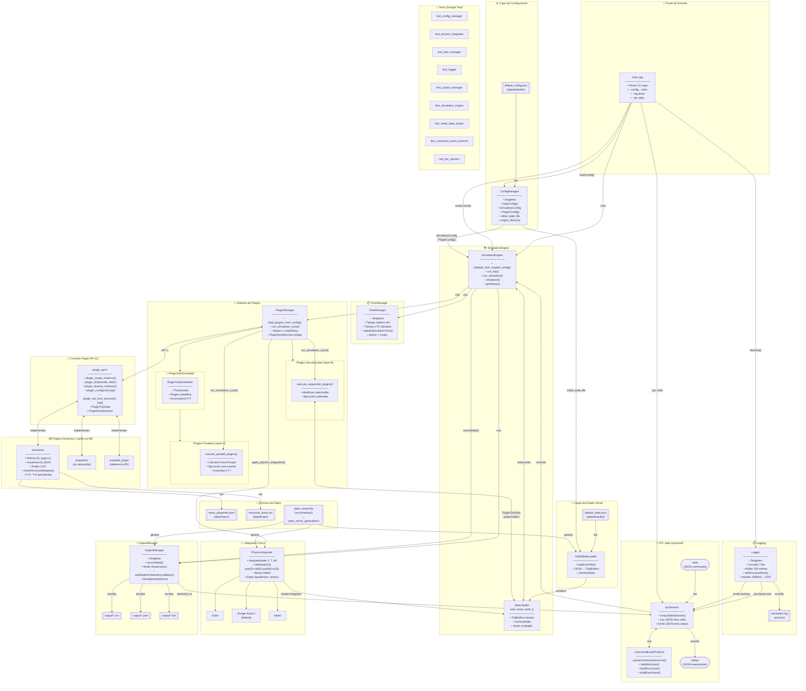
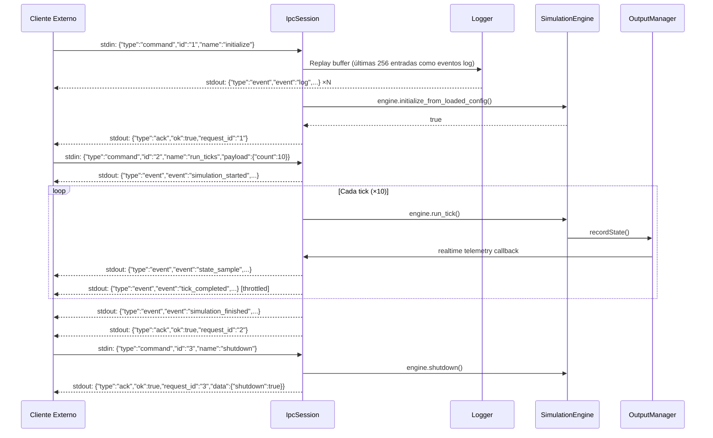
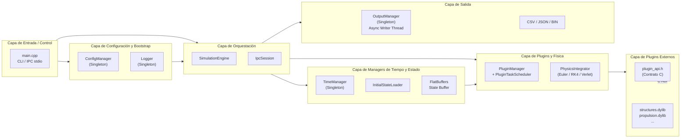
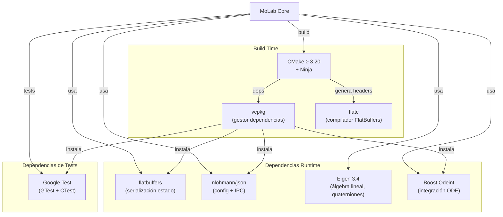

# MoLab — Diagrama de Arquitectura

## Diagrama General del Sistema



---

## Diagrama del Ciclo de Tick

```mermaid
sequenceDiagram
    participant Main
    participant SE as SimulationEngine
    participant PM as PluginManager
    participant SEQ as Sequential Plugins
    participant PAR as Parallel Plugins (threads)
    participant PI as PhysicsIntegrator
    participant TM as TimeManager
    participant OM as OutputManager

    Main->>SE: run_tick()
    activate SE

    SE->>PM: run_simulation_cycle(state_buffer, dt)
    activate PM

    PM->>SEQ: execute_sequential_plugins()
    loop Cada plugin type=0
        SEQ->>SEQ: plugin_tick(handle, TickData)
        note right of SEQ: Modifica state_buffer directamente
    end

    PM->>PAR: execute_parallel_plugins() [threads]
    par Plugin A
        PAR->>PAR: plugin_tick() → force_A, torque_A
    and Plugin B
        PAR->>PAR: plugin_tick() → force_B, torque_B
    end
    PAR-->>PM: accumulated_force, accumulated_torque

    PM->>PI: apply_physics_integration(state_buffer, F_total, T_total, dt)
    PI->>PI: FlatBuffers → PhysicsState
    PI->>PI: integrate(OdeState[13], dt)
    PI->>PI: PhysicsState → FlatBuffers
    PI-->>PM: state_buffer actualizado

    deactivate PM

    SE->>TM: updateSimulationTime(dt)
    SE->>OM: recordState(state_buffer, sim_time, utc_time, tick)
    note right of OM: Async writer thread → CSV/JSON/bin
    OM-->>SE: (callback telemetría si IPC activo)

    deactivate SE
    SE-->>Main: tick completado
```

---

## Diagrama del Modo IPC stdio



---

## Diagrama de Capas del Sistema



---

## Dependencias Externas


