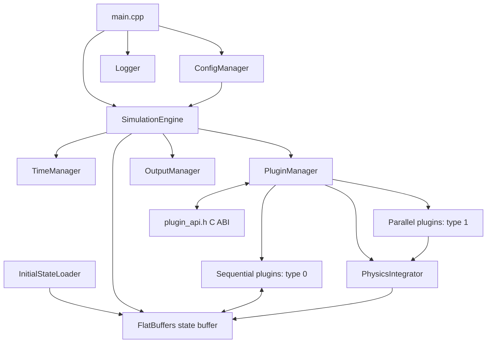
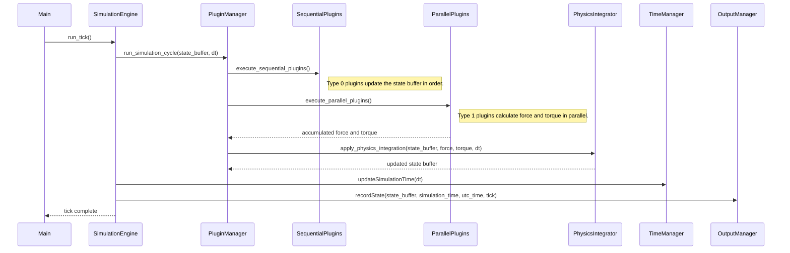
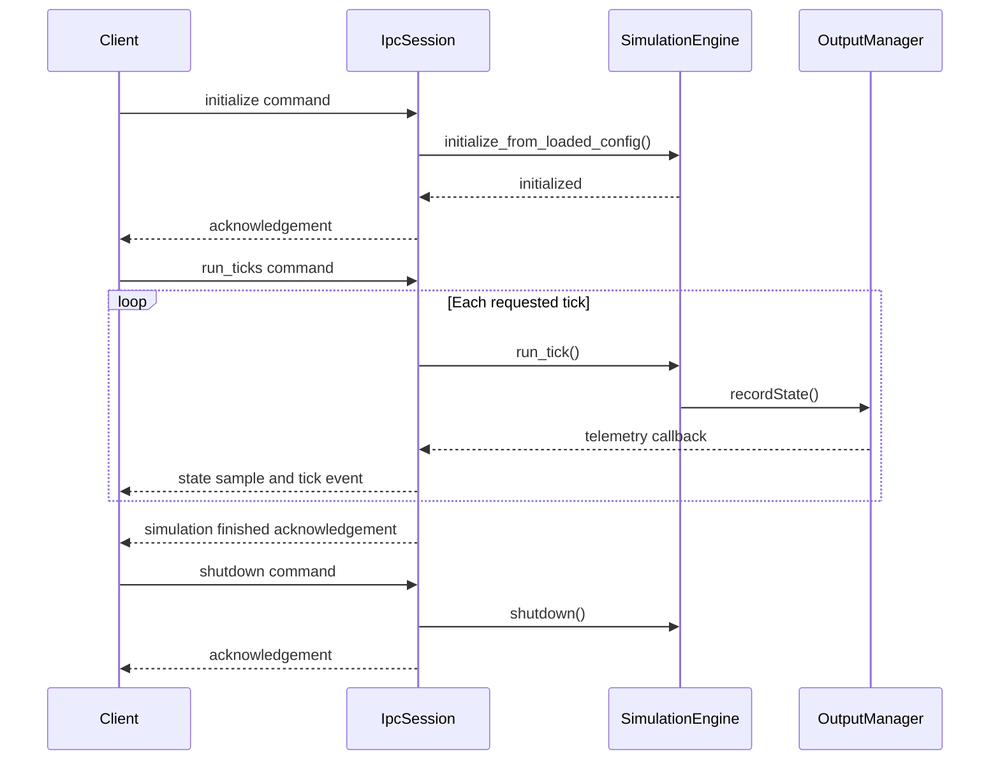
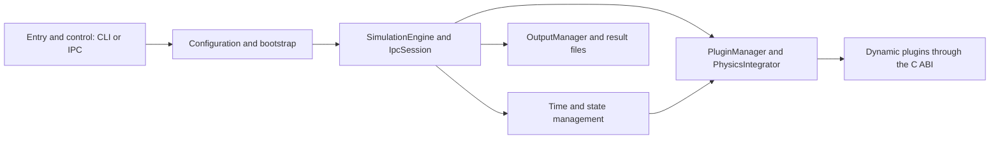
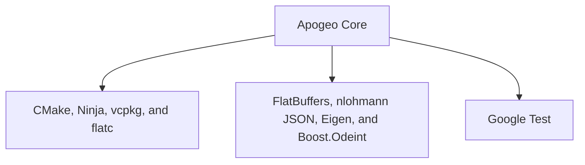

# Apogeo Architecture Diagrams

## System Overview

```mermaid
flowchart TB
    Main[main.cpp]
    Config[ConfigManager]
    Logger[Logger]
    Engine[SimulationEngine]
    Time[TimeManager]
    State[FlatBuffers state buffer]
    InitialState[InitialStateLoader]
    Plugins[PluginManager]
    Sequential[Sequential plugins: type 0]
    Parallel[Parallel plugins: type 1]
    Physics[PhysicsIntegrator]
    Output[OutputManager]
    PluginApi[plugin_api.h C ABI]

    Main --> Config
    Main --> Logger
    Main --> Engine
    Config --> Engine
    InitialState --> State
    Engine --> Time
    Engine --> State
    Engine --> Plugins
    Engine --> Output
    Plugins --> Sequential
    Plugins --> Parallel
    Plugins --> Physics
    Sequential <--> State
    Parallel --> Physics
    Physics --> State
    Plugins <--> PluginApi
```

## Simulation Tick

```mermaid
sequenceDiagram
    participant Main
    participant Engine as SimulationEngine
    participant Manager as PluginManager
    participant Sequential as SequentialPlugins
    participant Parallel as ParallelPlugins
    participant Physics as PhysicsIntegrator
    participant Time as TimeManager
    participant Output as OutputManager

    Main->>Engine: run_tick()
    Engine->>Manager: run_simulation_cycle(state_buffer, dt)
    Manager->>Sequential: execute_sequential_plugins()
    Note right of Sequential: Type 0 plugins update the state buffer in order.
    Manager->>Parallel: execute_parallel_plugins()
    Note right of Parallel: Type 1 plugins calculate force and torque in parallel.
    Parallel-->>Manager: accumulated force and torque
    Manager->>Physics: apply_physics_integration(state_buffer, force, torque, dt)
    Physics-->>Manager: updated state buffer
    Engine->>Time: updateSimulationTime(dt)
    Engine->>Output: recordState(state_buffer, simulation_time, utc_time, tick)
    Engine-->>Main: tick complete
```

## IPC Stdio Mode

```mermaid
sequenceDiagram
    participant Client
    participant Session as IpcSession
    participant Engine as SimulationEngine
    participant Output as OutputManager

    Client->>Session: initialize command
    Session->>Engine: initialize_from_loaded_config()
    Engine-->>Session: initialized
    Session-->>Client: acknowledgement

    Client->>Session: run_ticks command
    loop Each requested tick
        Session->>Engine: run_tick()
        Engine->>Output: recordState()
        Output-->>Session: telemetry callback
        Session-->>Client: state sample and tick event
    end
    Session-->>Client: simulation finished acknowledgement

    Client->>Session: shutdown command
    Session->>Engine: shutdown()
    Session-->>Client: acknowledgement
```

## Layered View

```mermaid
flowchart LR
    Entry[Entry and control: CLI or IPC]
    Bootstrap[Configuration and bootstrap]
    Orchestration[SimulationEngine and IpcSession]
    StateLayer[Time and state management]
    PhysicsLayer[PluginManager and PhysicsIntegrator]
    Extensions[Dynamic plugins through the C ABI]
    OutputLayer[OutputManager and result files]

    Entry --> Bootstrap --> Orchestration
    Orchestration --> StateLayer
    Orchestration --> PhysicsLayer
    Orchestration --> OutputLayer
    StateLayer --> PhysicsLayer
    PhysicsLayer --> Extensions
```

## External Dependencies

```mermaid
flowchart TD
    Apogeo[Apogeo Core]
    Build[CMake, Ninja, vcpkg, and flatc]
    Runtime[FlatBuffers, nlohmann JSON, Eigen, and Boost.Odeint]
    Tests[Google Test]

    Apogeo --> Build
    Apogeo --> Runtime
    Apogeo --> Tests
```
