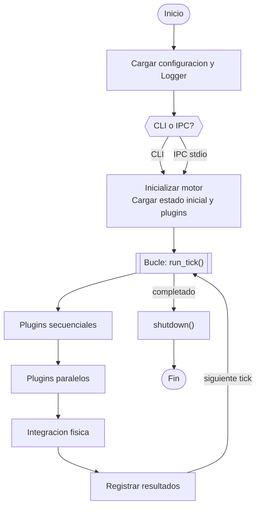
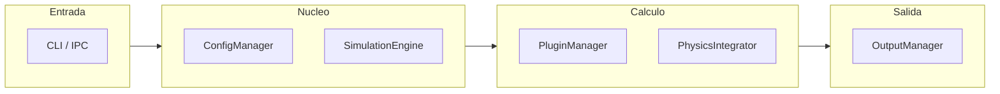
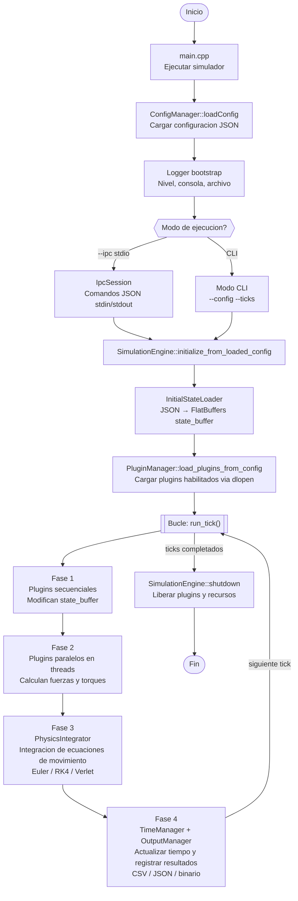

# MoLab — Diagrama de Arquitectura (Lucidchart)

## Importar en Lucidchart

**Insert → Import → Mermaid** → pegar código → Insert

---

## Diagrama 1 — Flujo de Ejecucion

---

## Diagrama 2 — Componentes

---

## Diagrama 3 — Flujo de Ejecucion (detallado)

