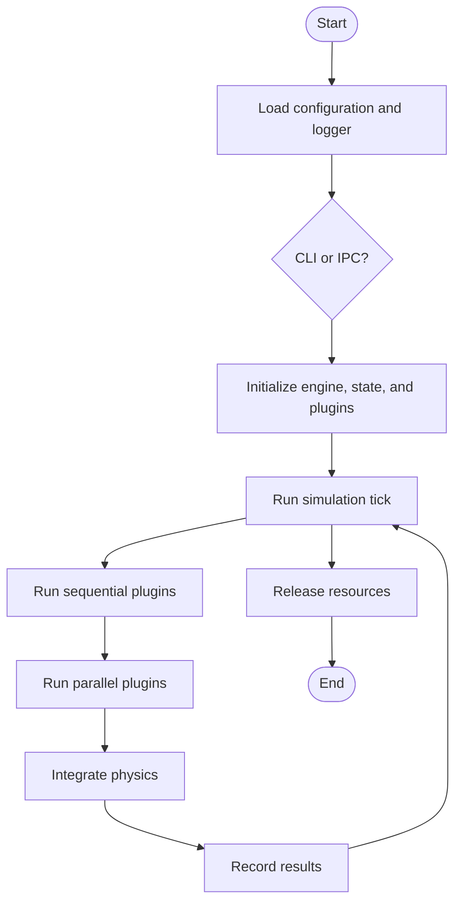
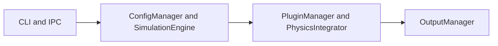
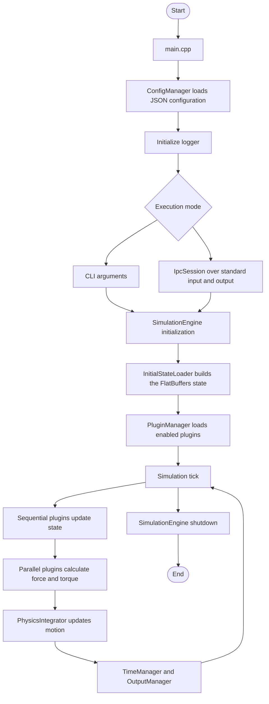

# Apogeo Architecture Diagrams for Lucidchart

## Importing a Diagram

Each Mermaid block below is source code for a diagram. To import one into
Lucidchart, copy the complete block without the surrounding Markdown fences,
then select **Insert**, **Import**, and **Mermaid** in Lucidchart. Paste the
code in the import dialog and select **Insert**.

## Diagram 1: Execution Flow

## Diagram 2: Components

## Diagram 3: Detailed Execution Flow

