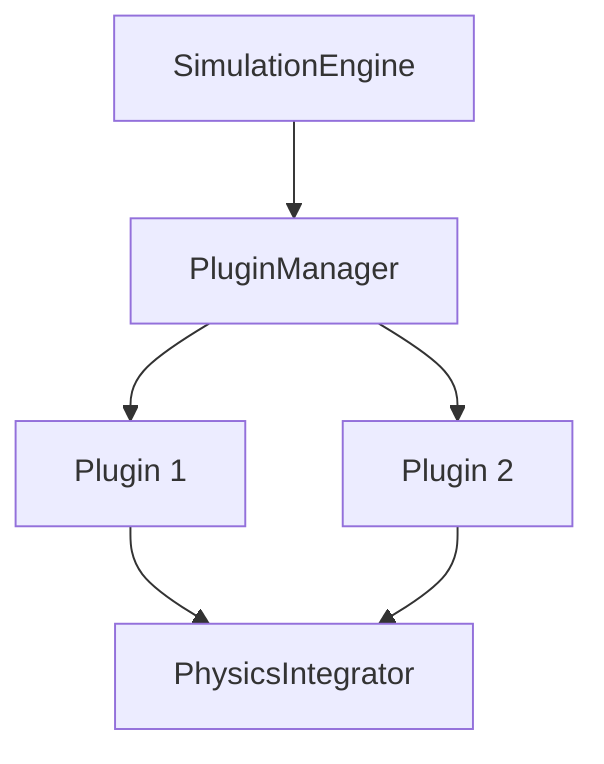
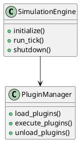

# Diagramas y Visualizaciones - MoLab

Este directorio contiene diagramas técnicos, visualizaciones de arquitectura y esquemas de flujo que ayudan a comprender el funcionamiento interno del sistema de simulación aeroespacial MoLab.

## 📊 Diagramas Disponibles

### 🏗️ **[Arquitectura del Sistema](./arquitectura-sistema.md)**
- Diagrama de componentes principales
- Relaciones entre módulos
- Flujo de datos y control
- Interfaces y APIs

### 🔄 **[Flujo de Simulación](./flujo-simulacion.md)**
- Secuencia de ejecución paso a paso
- Ciclo de vida de un tick de simulación
- Interacciones entre componentes
- Puntos de sincronización

### 🔌 **[Sistema de Plugins](./sistema-plugins.md)**
- Arquitectura de plugins
- Tipos de plugins y sus roles
- Flujo de carga y ejecución
- Comunicación entre plugins

### 📦 **[Gestión de Estado](./gestion-estado.md)**
- Esquema FlatBuffers
- Serialización y deserialización
- Compartición de estado entre componentes
- Versionado y compatibilidad

### 🌐 **[Interfaces de Usuario](./interfaces-usuario.md)**
- Arquitectura de interfaces múltiples
- Comunicación cliente-servidor
- APIs REST y WebSocket
- Flujos de interacción

### ⚡ **[Integración Física](./integracion-fisica.md)**
- Pipeline de cálculo físico
- Acumulación de fuerzas
- Métodos de integración numérica
- Validación y estabilidad

## 🎨 Tipos de Diagramas

### 📋 **Diagramas de Secuencia**
Muestran la interacción temporal entre componentes:
- Inicialización del sistema
- Ejecución de simulación
- Procesamiento de plugins
- Manejo de errores

### 🔀 **Diagramas de Flujo**
Representan el flujo de control y datos:
- Algoritmos de simulación
- Lógica de plugins
- Procesamiento de configuración
- Generación de resultados

### 🏛️ **Diagramas de Arquitectura**
Ilustran la estructura del sistema:
- Componentes y módulos
- Dependencias y relaciones
- Capas de abstracción
- Patrones de diseño

### 📊 **Diagramas de Estado**
Modelan los estados del sistema:
- Estados de simulación
- Transiciones de plugins
- Ciclo de vida de componentes
- Manejo de errores

## 🛠️ Herramientas de Generación

### 📝 **Mermaid.js**
Diagramas en formato texto para documentación:

### 🎨 **PlantUML**
Diagramas UML profesionales:

### 🖼️ **Draw.io / Lucidchart**
Diagramas visuales complejos:
- Arquitecturas de alto nivel
- Flujos de datos detallados
- Diagramas de red
- Esquemas de despliegue

## 📐 Convenciones de Diagramas

### 🎨 **Código de Colores**

| Color | Componente | Descripción |
|-------|------------|-------------|
| 🔵 Azul | Core System | Componentes principales del sistema |
| 🟢 Verde | Plugins | Módulos de plugins y extensiones |
| 🟡 Amarillo | Interfaces | APIs, GUIs, y puntos de entrada |
| 🟠 Naranja | Data Flow | Flujo de datos y estado |
| 🔴 Rojo | Error Handling | Manejo de errores y validación |
| 🟣 Morado | Configuration | Configuración y parámetros |

### 📏 **Símbolos Estándar**

#### **Componentes**
- 📦 **Módulo**: Componente independiente
- 🔧 **Servicio**: Servicio o utilidad
- 📊 **Datos**: Estructura de datos o estado
- 🔌 **Plugin**: Plugin o extensión
- 🌐 **Interface**: Interfaz de usuario o API

#### **Conexiones**
- ➡️ **Flujo de Datos**: Transferencia de información
- 🔄 **Comunicación**: Comunicación bidireccional
- ⚡ **Evento**: Notificación o evento
- 🔗 **Dependencia**: Relación de dependencia
- 🎯 **Control**: Flujo de control

#### **Estados**
- ✅ **Activo**: Componente activo/funcionando
- ⏸️ **Pausado**: Componente pausado/esperando
- ❌ **Error**: Estado de error
- 🔄 **Procesando**: En proceso de ejecución
- 💤 **Inactivo**: Componente inactivo

## 📋 Casos de Uso de Diagramas

### 🎯 **Para Desarrolladores**
- Comprensión de la arquitectura
- Identificación de puntos de extensión
- Debugging y troubleshooting
- Planificación de nuevas características

### 👥 **Para Usuarios Técnicos**
- Configuración avanzada del sistema
- Optimización de rendimiento
- Integración con otros sistemas
- Personalización de workflows

### 📚 **Para Documentación**
- Explicación visual de conceptos
- Guías de implementación
- Tutoriales paso a paso
- Referencias técnicas

### 🔍 **Para Análisis**
- Identificación de cuellos de botella
- Análisis de flujos de datos
- Validación de diseño
- Planificación de escalabilidad

## 🔧 Mantenimiento de Diagramas

### 📅 **Versionado**
- Cada diagrama incluye número de versión
- Changelog de modificaciones importantes
- Compatibilidad con versiones del código
- Fechas de última actualización

### 🔄 **Sincronización**
- Actualización automática cuando sea posible
- Revisión manual periódica
- Validación contra implementación actual
- Notificaciones de cambios importantes

### ✅ **Validación**
- Revisión por pares de diagramas críticos
- Verificación de consistencia
- Pruebas de comprensión con usuarios
- Feedback de la comunidad

## 📖 Guías de Lectura

### 🚀 **Para Principiantes**
1. Empezar con [Arquitectura del Sistema](./arquitectura-sistema.md)
2. Continuar con [Flujo de Simulación](./flujo-simulacion.md)
3. Explorar [Sistema de Plugins](./sistema-plugins.md)
4. Profundizar en diagramas específicos según necesidad

### 🔧 **Para Desarrolladores**
1. Revisar [Gestión de Estado](./gestion-estado.md)
2. Estudiar [Integración Física](./integracion-fisica.md)
3. Analizar [Sistema de Plugins](./sistema-plugins.md)
4. Consultar diagramas de implementación específicos

### 🌐 **Para Integradores**
1. Examinar [Interfaces de Usuario](./interfaces-usuario.md)
2. Comprender [Arquitectura del Sistema](./arquitectura-sistema.md)
3. Revisar APIs y puntos de integración
4. Planificar según diagramas de despliegue

## 🔗 Enlaces Relacionados

### 📚 **Documentación Técnica**
- [Arquitectura del Sistema](../02-arquitectura.md)
- [Referencia de API](../03-referencia.md)
- [Desarrollo de Plugins](../04-desarrollo-plugins.md)

### 🛠️ **Herramientas de Desarrollo**
- [Guía de Instalación](../05-instalacion.md)
- [Configuración del Sistema](../07-configuracion.md)
- [Solución de Problemas](../troubleshooting.md)

### 🔌 **Plugins y Extensiones**
- [Documentación de Plugins](../plugins/)
- [Ejemplos de Configuración](../ejemplos/)
- [Plantillas de Desarrollo](../templates/)

Los diagramas en este directorio son una herramienta esencial para comprender, desarrollar y mantener el sistema MoLab. Se actualizan regularmente para reflejar el estado actual del código y las mejores prácticas de la industria aeroespacial.
