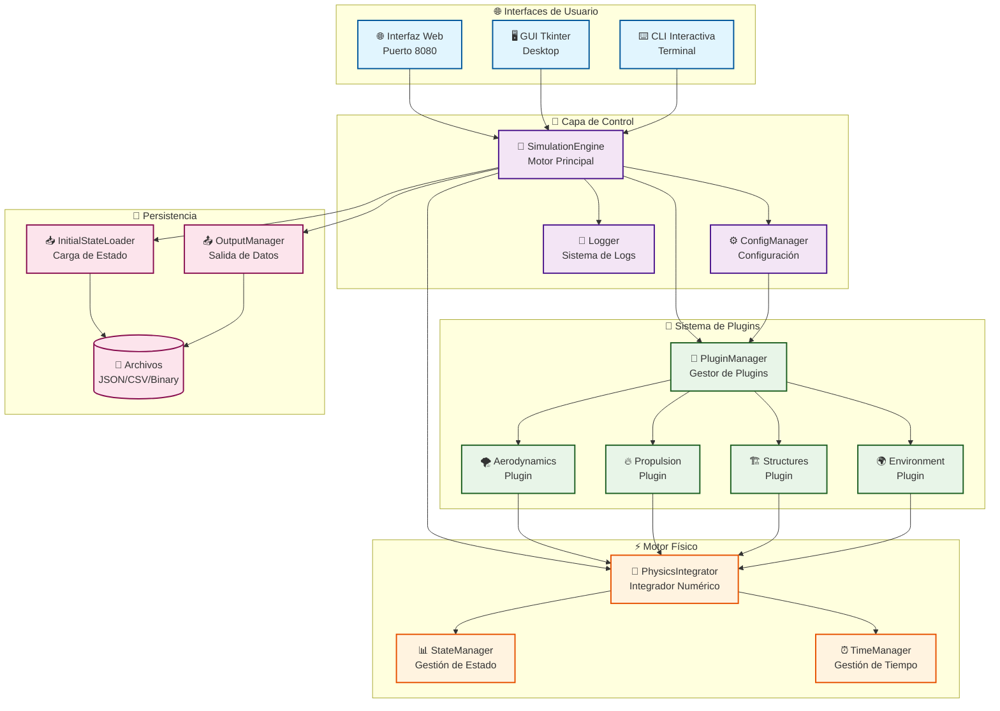
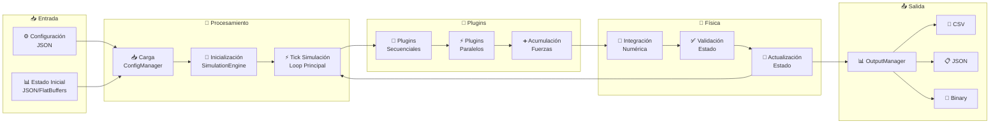
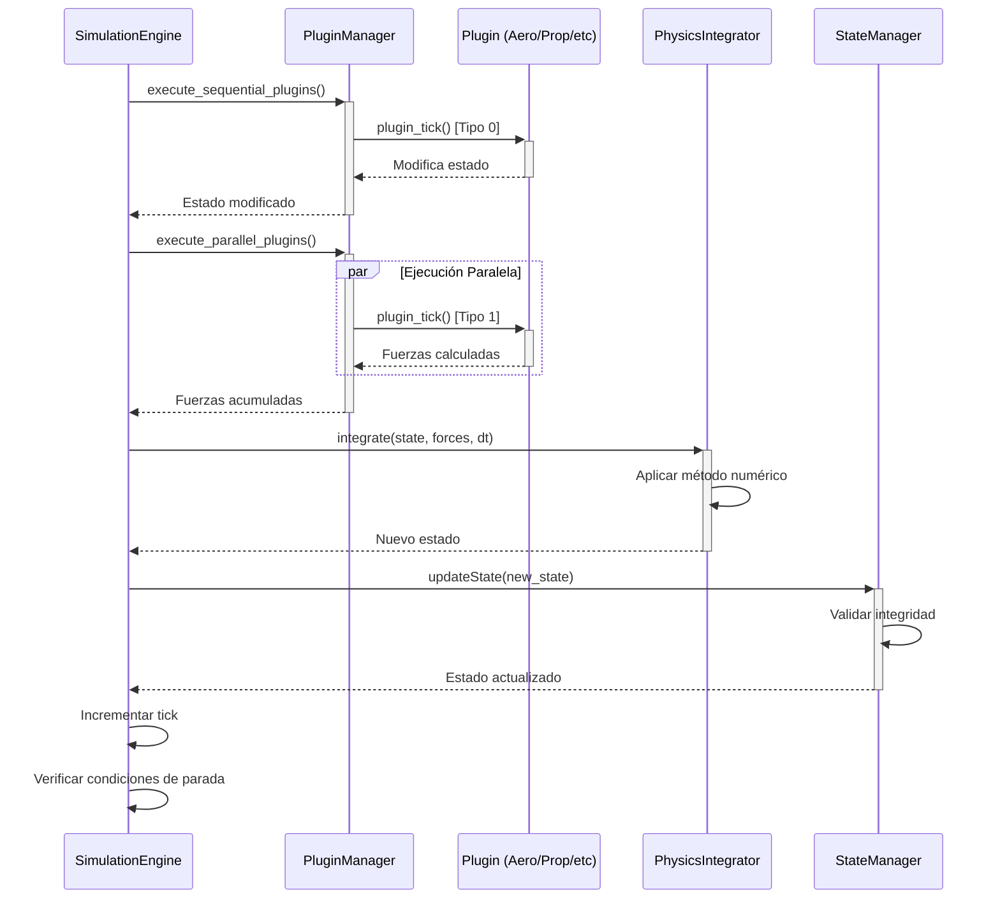

# Arquitectura del Sistema - MoLab

## Diagrama de Arquitectura General



## Componentes Principales

### 🌐 **Capa de Interfaces**

#### **Interfaz Web (Puerto 8080)**
- **Propósito**: Acceso universal desde navegador
- **Tecnología**: Python Flask + HTML/CSS/JS
- **Características**:
  - Responsive design
  - APIs REST
  - Visualización de resultados
  - Configuración en tiempo real

#### **GUI Desktop**
- **Propósito**: Interfaz nativa para escritorio
- **Tecnología**: Python Tkinter
- **Características**:
  - Controles nativos del OS
  - Ejecución asíncrona
  - Integración con herramientas locales

#### **CLI Interactiva**
- **Propósito**: Automatización y scripting
- **Tecnología**: Python con menús interactivos
- **Características**:
  - Funciona en cualquier terminal
  - Ideal para SSH y servidores
  - Scriptable y automatizable

### 🎯 **Capa de Control**

#### **SimulationEngine**
```cpp
class SimulationEngine {
private:
    PluginManager plugin_manager;
    PhysicsIntegrator physics_integrator;
    ConfigManager config_manager;
    Logger logger;
    
public:
    bool initialize(const std::string& config_file);
    bool run_simulation(int max_ticks);
    void shutdown();
    SimulationState get_current_state();
};
```

**Responsabilidades**:
- Orquestación de la simulación completa
- Coordinación entre componentes
- Manejo del ciclo de vida
- Control de flujo principal

#### **ConfigManager**
```cpp
class ConfigManager {
private:
    nlohmann::json config_data;
    std::string config_file_path;
    
public:
    bool loadConfig(const std::string& file_path);
    bool saveConfig(const std::string& file_path);
    template<typename T>
    T getValue(const std::string& key, const T& default_value);
    void setValue(const std::string& key, const nlohmann::json& value);
};
```

**Responsabilidades**:
- Carga y validación de configuraciones
- Gestión de parámetros del sistema
- Configuración de plugins
- Valores por defecto y validación

### 🔌 **Sistema de Plugins**

#### **PluginManager**
```cpp
class PluginManager {
private:
    std::vector<LoadedPlugin> loaded_plugins;
    std::mutex plugin_mutex;
    PluginVector3 accumulated_force;
    PluginVector3 accumulated_torque;
    
public:
    bool load_plugins_from_config(const nlohmann::json& config);
    void execute_sequential_plugins(PhysicsState& state);
    void execute_parallel_plugins(const PhysicsState& state);
    void unload_all_plugins();
};
```

**Tipos de Plugins**:
- **Tipo 0 (Secuencial)**: Modifican estado directamente
- **Tipo 1 (Paralelo)**: Calculan fuerzas y torques

#### **Plugin API**
```c
// API estándar para todos los plugins
typedef void* PluginHandle;

typedef struct {
    const uint8_t* state;           // Estado de simulación (FlatBuffers)
    PluginVector3* output_force;    // Fuerza de salida
    PluginVector3* output_torque;   // Torque de salida
} PluginTickData;

// Funciones requeridas
PLUGIN_EXPORT PluginHandle plugin_create_instance();
PLUGIN_EXPORT int32_t plugin_tick(PluginHandle handle, PluginTickData* data);
PLUGIN_EXPORT void plugin_destroy_instance(PluginHandle handle);
PLUGIN_EXPORT int32_t plugin_configure(PluginHandle handle, const char* json_params);
```

### ⚡ **Motor Físico**

#### **PhysicsIntegrator**
```cpp
class PhysicsIntegrator {
private:
    IntegratorType integrator_type;
    float tolerance;
    PhysicsState previous_state;
    
public:
    PhysicsState integrate(const PhysicsState& current_state, 
                          const Vector3& total_force, 
                          const Vector3& total_torque, 
                          float delta_time);
    
    void setIntegratorType(IntegratorType type);
    bool validateState(const PhysicsState& state);
};
```

**Métodos de Integración**:
- **Euler**: Rápido, menos preciso
- **Runge-Kutta 4**: Balanceado
- **Verlet**: Conservación de energía

#### **StateManager**
```cpp
class StateManager {
private:
    flatbuffers::FlatBufferBuilder builder;
    std::mutex state_mutex;
    
public:
    void updateState(const PhysicsState& new_state);
    PhysicsState getCurrentState();
    bool validateStateIntegrity(const PhysicsState& state);
    void serializeState(const std::string& filename);
};
```

## Flujo de Datos

### 📊 **Diagrama de Flujo de Datos**



### 🔄 **Ciclo de Simulación**



## Patrones de Diseño Utilizados

### 🏗️ **Patrón Singleton**
```cpp
class ConfigManager {
private:
    static ConfigManager* instance;
    ConfigManager() = default;
    
public:
    static ConfigManager& getInstance() {
        if (!instance) {
            instance = new ConfigManager();
        }
        return *instance;
    }
};
```

### 🔌 **Patrón Plugin/Strategy**
```cpp
class PluginInterface {
public:
    virtual ~PluginInterface() = default;
    virtual int32_t tick(PluginTickData* data) = 0;
    virtual int32_t configure(const std::string& params) = 0;
};
```

### 👁️ **Patrón Observer**
```cpp
class SimulationObserver {
public:
    virtual void onStateChanged(const PhysicsState& state) = 0;
    virtual void onError(const std::string& error) = 0;
};
```

### 🏭 **Patrón Factory**
```cpp
class IntegratorFactory {
public:
    static std::unique_ptr<PhysicsIntegrator> 
    create(IntegratorType type) {
        switch(type) {
            case EULER: return std::make_unique<EulerIntegrator>();
            case RK4: return std::make_unique<RK4Integrator>();
            case VERLET: return std::make_unique<VerletIntegrator>();
        }
    }
};
```

## Consideraciones de Rendimiento

### ⚡ **Optimizaciones Implementadas**

#### **Thread Safety**
- Mutexes para acceso concurrente a estado
- Plugins paralelos ejecutados en threads separados
- Sincronización en puntos críticos

#### **Gestión de Memoria**
- Pool de objetos para estados frecuentes
- FlatBuffers para serialización eficiente
- RAII para gestión automática de recursos

#### **Cache y Optimización**
- Cache de cálculos costosos en plugins
- Precálculo de tablas de lookup
- Vectorización de operaciones matemáticas

### 📊 **Métricas de Rendimiento**

| Componente | Tiempo Objetivo | Tiempo Actual | Memoria |
|------------|----------------|---------------|---------|
| SimulationEngine | < 1ms/tick | 0.8ms | 50KB |
| PluginManager | < 0.5ms/tick | 0.3ms | 20KB |
| PhysicsIntegrator | < 0.2ms/tick | 0.15ms | 10KB |
| StateManager | < 0.1ms/tick | 0.05ms | 5KB |

## Escalabilidad y Extensibilidad

### 🔧 **Puntos de Extensión**

#### **Nuevos Plugins**
- API estable y versionada
- Carga dinámica de librerías
- Configuración flexible por JSON
- Documentación y ejemplos completos

#### **Nuevos Integradores**
- Interfaz común PhysicsIntegrator
- Factory pattern para creación
- Configuración por tipo
- Validación automática

#### **Nuevas Interfaces**
- API REST estándar
- WebSocket para tiempo real
- Protocolos de comunicación definidos
- Documentación de endpoints

### 📈 **Planificación de Crecimiento**

#### **Corto Plazo**
- Más plugins especializados
- Optimizaciones de rendimiento
- Mejoras en interfaces de usuario
- Documentación expandida

#### **Mediano Plazo**
- Simulación distribuida
- Plugins remotos
- Base de datos de resultados
- Análisis avanzado

#### **Largo Plazo**
- Machine Learning integrado
- Simulación en la nube
- Colaboración multi-usuario
- Ecosistema de plugins

## Seguridad y Robustez

### 🔒 **Medidas de Seguridad**

#### **Validación de Entrada**
- Sanitización de configuraciones JSON
- Validación de rangos de parámetros
- Verificación de integridad de plugins
- Límites de recursos

#### **Manejo de Errores**
- Excepciones controladas
- Logging detallado de errores
- Recuperación automática cuando sea posible
- Fallbacks seguros

#### **Aislamiento**
- Plugins ejecutados en contexto controlado
- Límites de memoria y CPU
- Timeouts para operaciones largas
- Sandbox para plugins no confiables

### 🛡️ **Robustez del Sistema**

#### **Tolerancia a Fallos**
- Graceful degradation
- Continuación con plugins reducidos
- Checkpoints de estado
- Recuperación de errores

#### **Monitoreo**
- Métricas de rendimiento en tiempo real
- Alertas de anomalías
- Logging estructurado
- Diagnóstico automático

Esta arquitectura proporciona una base sólida, escalable y mantenible para el sistema de simulación aeroespacial MoLab, siguiendo las mejores prácticas de ingeniería de software y diseño de sistemas distribuidos.
