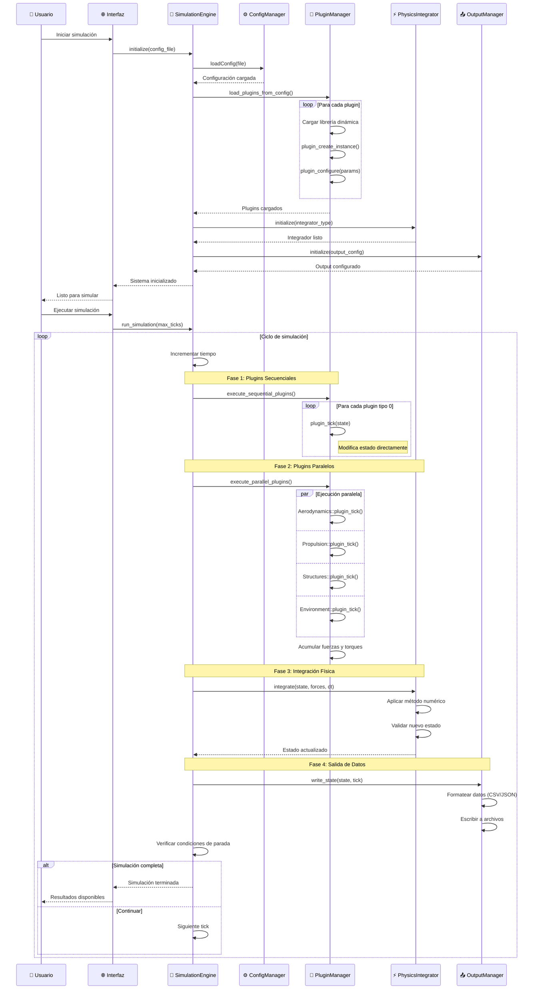
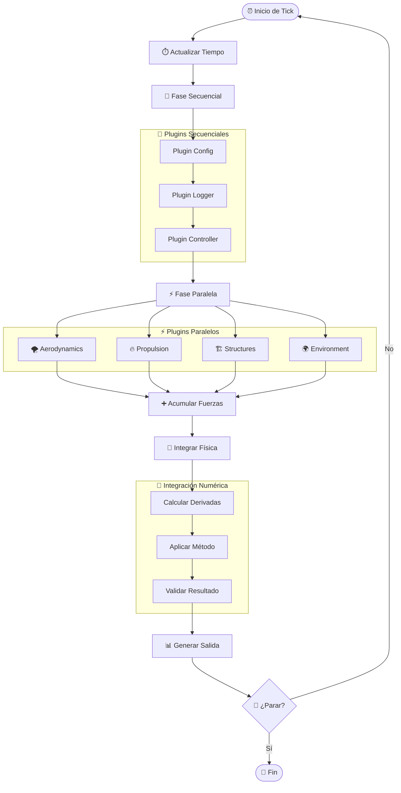
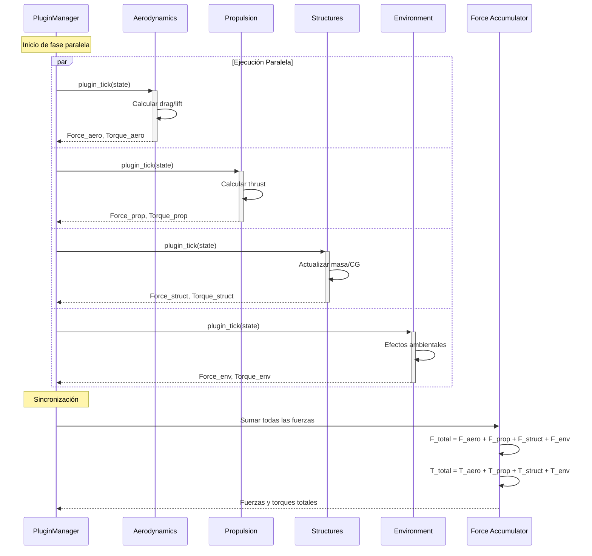
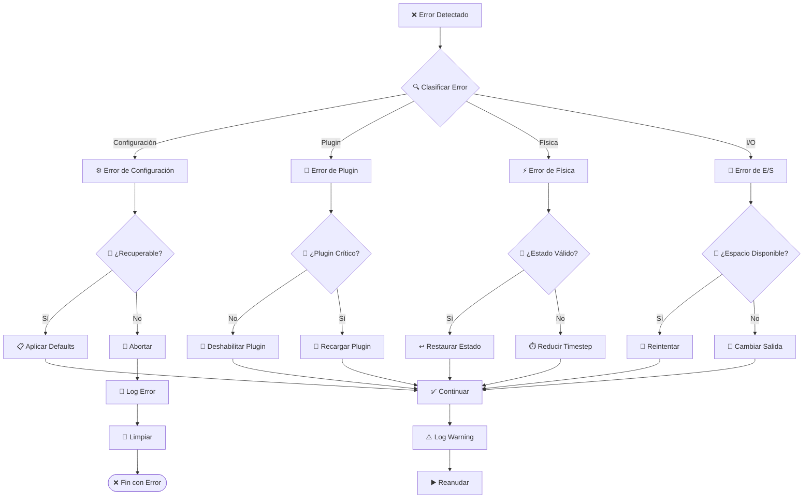
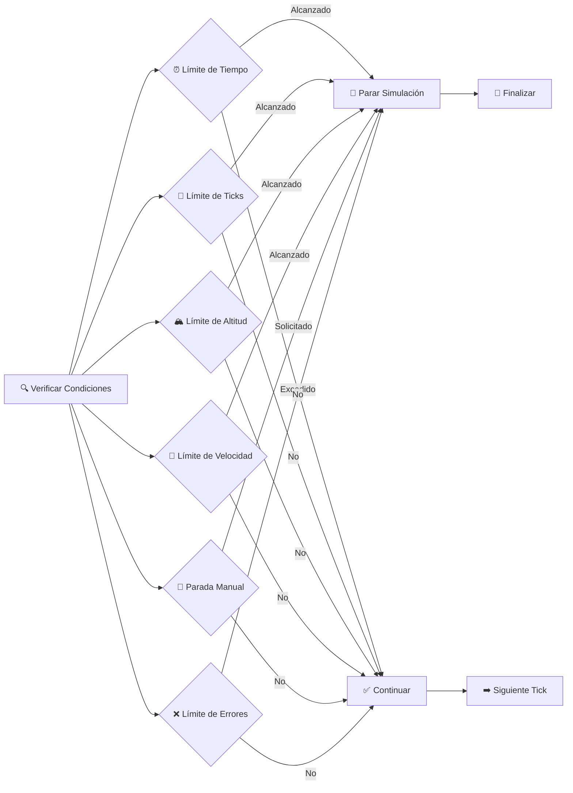

# Flujo de Simulación - MoLab

## Diagrama de Secuencia Principal

## Diagrama de Flujo Detallado

```mermaid
flowchart TD
    START([🚀 Inicio de Simulación]) --> LOAD_CONFIG{📋 Cargar Configuración}
    
    LOAD_CONFIG -->|Éxito| VALIDATE_CONFIG[✅ Validar Parámetros]
    LOAD_CONFIG -->|Error| ERROR_CONFIG[❌ Error de Configuración]
    ERROR_CONFIG --> END_ERROR([🛑 Fin con Error])
    
    VALIDATE_CONFIG --> LOAD_PLUGINS{🔌 Cargar Plugins}
    
    LOAD_PLUGINS -->|Éxito| INIT_PHYSICS[⚡ Inicializar Física]
    LOAD_PLUGINS -->|Error| ERROR_PLUGINS[❌ Error de Plugins]
    ERROR_PLUGINS --> END_ERROR
    
    INIT_PHYSICS --> LOAD_INITIAL_STATE[📊 Cargar Estado Inicial]
    LOAD_INITIAL_STATE --> SETUP_OUTPUT[📤 Configurar Salida]
    SETUP_OUTPUT --> SIMULATION_READY[✅ Sistema Listo]
    
    SIMULATION_READY --> TICK_START[⏰ Iniciar Tick]
    
    TICK_START --> INCREMENT_TIME[⏱️ Incrementar Tiempo]
    INCREMENT_TIME --> EXEC_SEQUENTIAL[📝 Ejecutar Plugins Secuenciales]
    
    EXEC_SEQUENTIAL --> CHECK_SEQ_ERRORS{❓ Errores Secuenciales}
    CHECK_SEQ_ERRORS -->|Sí| HANDLE_SEQ_ERROR[🔧 Manejar Error]
    CHECK_SEQ_ERRORS -->|No| EXEC_PARALLEL[⚡ Ejecutar Plugins Paralelos]
    
    HANDLE_SEQ_ERROR --> CONTINUE_DECISION{🤔 ¿Continuar?}
    CONTINUE_DECISION -->|Sí| EXEC_PARALLEL
    CONTINUE_DECISION -->|No| END_ERROR
    
    EXEC_PARALLEL --> ACCUMULATE_FORCES[➕ Acumular Fuerzas]
    ACCUMULATE_FORCES --> CHECK_PAR_ERRORS{❓ Errores Paralelos}
    
    CHECK_PAR_ERRORS -->|Sí| HANDLE_PAR_ERROR[🔧 Manejar Error]
    CHECK_PAR_ERRORS -->|No| PHYSICS_INTEGRATION[🧮 Integración Física]
    
    HANDLE_PAR_ERROR --> PHYSICS_INTEGRATION
    
    PHYSICS_INTEGRATION --> VALIDATE_STATE{✅ Validar Estado}
    
    VALIDATE_STATE -->|Válido| UPDATE_STATE[🔄 Actualizar Estado]
    VALIDATE_STATE -->|Inválido| HANDLE_PHYSICS_ERROR[🔧 Error Físico]
    
    HANDLE_PHYSICS_ERROR --> RECOVERY_DECISION{🤔 ¿Recuperar?}
    RECOVERY_DECISION -->|Sí| RESTORE_STATE[↩️ Restaurar Estado]
    RECOVERY_DECISION -->|No| END_ERROR
    RESTORE_STATE --> UPDATE_STATE
    
    UPDATE_STATE --> OUTPUT_DATA[📊 Generar Salida]
    OUTPUT_DATA --> CHECK_STOP_CONDITIONS{🛑 ¿Condiciones de Parada?}
    
    CHECK_STOP_CONDITIONS -->|Continuar| TICK_START
    CHECK_STOP_CONDITIONS -->|Parar| FINALIZE[🏁 Finalizar Simulación]
    
    FINALIZE --> CLEANUP[🧹 Limpiar Recursos]
    CLEANUP --> GENERATE_REPORT[📋 Generar Reporte]
    GENERATE_REPORT --> END_SUCCESS([✅ Fin Exitoso])
    
    %% Estilos
    classDef startEnd fill:#e8f5e8,stroke:#2e7d32,stroke-width:3px
    classDef process fill:#e3f2fd,stroke:#1565c0,stroke-width:2px
    classDef decision fill:#fff3e0,stroke:#ef6c00,stroke-width:2px
    classDef error fill:#ffebee,stroke:#c62828,stroke-width:2px
    classDef success fill:#e8f5e8,stroke:#388e3c,stroke-width:2px
    
    class START,END_SUCCESS,END_ERROR startEnd
    class INCREMENT_TIME,EXEC_SEQUENTIAL,EXEC_PARALLEL,ACCUMULATE_FORCES,PHYSICS_INTEGRATION,UPDATE_STATE,OUTPUT_DATA process
    class LOAD_CONFIG,LOAD_PLUGINS,CHECK_SEQ_ERRORS,CHECK_PAR_ERRORS,VALIDATE_STATE,CHECK_STOP_CONDITIONS decision
    class ERROR_CONFIG,ERROR_PLUGINS,HANDLE_SEQ_ERROR,HANDLE_PAR_ERROR,HANDLE_PHYSICS_ERROR error
    class SIMULATION_READY,FINALIZE success
```

## Fases Detalladas de Ejecución

### 🏁 **Fase 1: Inicialización**

```mermaid
flowchart LR
    subgraph "📋 Configuración"
        A1[Cargar JSON] --> A2[Validar Parámetros]
        A2 --> A3[Aplicar Defaults]
    end
    
    subgraph "🔌 Plugins"
        B1[Escanear Directorio] --> B2[Cargar Librerías]
        B2 --> B3[Crear Instancias]
        B3 --> B4[Configurar Parámetros]
    end
    
    subgraph "⚡ Física"
        C1[Seleccionar Integrador] --> C2[Configurar Tolerancia]
        C2 --> C3[Inicializar Estado]
    end
    
    subgraph "📤 Salida"
        D1[Crear Directorios] --> D2[Configurar Formatos]
        D2 --> D3[Inicializar Archivos]
    end
    
    A3 --> B1
    B4 --> C1
    C3 --> D1
```

### ⚡ **Fase 2: Ciclo de Simulación**

### 📊 **Fase 3: Procesamiento de Plugins**

## Manejo de Errores y Recuperación

### 🔧 **Estrategias de Manejo de Errores**

### 📊 **Métricas de Rendimiento por Fase**

| Fase | Tiempo Objetivo | Tiempo Típico | Porcentaje |
|------|----------------|---------------|------------|
| Inicialización | < 100ms | 80ms | - |
| Plugins Secuenciales | < 0.1ms | 0.05ms | 5% |
| Plugins Paralelos | < 0.5ms | 0.3ms | 30% |
| Integración Física | < 0.2ms | 0.15ms | 15% |
| Validación Estado | < 0.1ms | 0.05ms | 5% |
| Salida de Datos | < 0.4ms | 0.25ms | 25% |
| Overhead Sistema | < 0.2ms | 0.15ms | 15% |
| **Total por Tick** | **< 1.5ms** | **< 1.0ms** | **100%** |

### 🎯 **Condiciones de Parada**

## Optimizaciones de Flujo

### ⚡ **Paralelización**

- **Plugins Paralelos**: Ejecución simultánea en threads separados
- **I/O Asíncrono**: Escritura de datos en background
- **Pipeline**: Solapamiento de fases cuando sea posible
- **Cache**: Reutilización de cálculos costosos

### 🎯 **Predicción y Adaptación**

- **Timestep Adaptativo**: Ajuste automático según estabilidad
- **Plugin Scheduling**: Priorización basada en importancia
- **Memory Pooling**: Reutilización de objetos frecuentes
- **Lazy Loading**: Carga bajo demanda de recursos

Este flujo de simulación garantiza ejecución eficiente, robusta y escalable del sistema MoLab, manteniendo alta precisión física y excelente rendimiento computacional.
