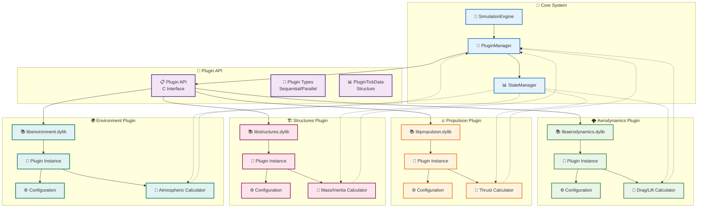
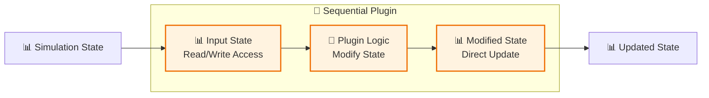
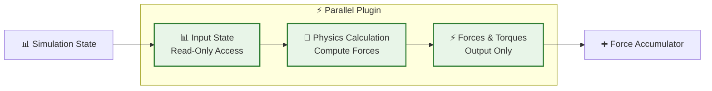
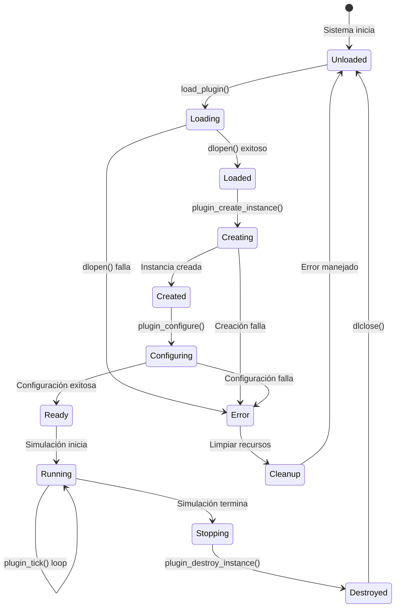
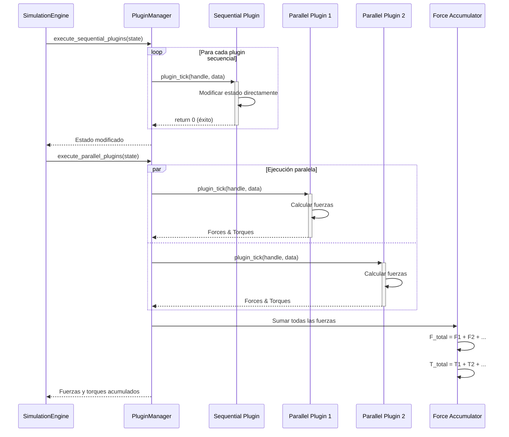

# Sistema de Plugins - MoLab

## Arquitectura del Sistema de Plugins



## Tipos de Plugins

### 📝 **Tipo 0: Plugins Secuenciales (State Modifiers)**



**Características**:
- Acceso completo de lectura/escritura al estado
- Ejecución secuencial ordenada
- No calculan fuerzas/torques
- Casos de uso: configuración, logging, control

**Ejemplos**:
- Plugin de configuración dinámica
- Plugin de logging de telemetría
- Plugin de control de vuelo
- Plugin de eventos programados

### ⚡ **Tipo 1: Plugins Paralelos (Physics Calculators)**



**Características**:
- Acceso de solo lectura al estado
- Ejecución paralela thread-safe
- Calculan fuerzas y torques
- Casos de uso: física, aerodinámica, propulsión

**Ejemplos**:
- Plugin de aerodinámica (drag/lift)
- Plugin de propulsión (thrust)
- Plugin de estructuras (masa/inercia)
- Plugin de ambiente (efectos atmosféricos)

## Interfaz de Plugin (API)

### 🔧 **Estructura de la API**

```c
// Definiciones de tipos
typedef void* PluginHandle;
typedef int32_t PluginType; // 0 = Sequential, 1 = Parallel

// Estructura de datos para comunicación
typedef struct {
    float x, y, z;
} PluginVector3;

typedef struct {
    const uint8_t* state;           // Estado de simulación (FlatBuffers)
    size_t state_size;              // Tamaño del buffer de estado
    PluginVector3* output_force;    // Fuerza de salida (solo Tipo 1)
    PluginVector3* output_torque;   // Torque de salida (solo Tipo 1)
    float delta_time;               // Timestep de simulación
    uint32_t tick_number;           // Número de tick actual
} PluginTickData;

// Funciones requeridas para todos los plugins
PLUGIN_EXPORT PluginHandle plugin_create_instance();
PLUGIN_EXPORT int32_t plugin_tick(PluginHandle handle, PluginTickData* data);
PLUGIN_EXPORT void plugin_destroy_instance(PluginHandle handle);

// Funciones opcionales
PLUGIN_EXPORT int32_t plugin_configure(PluginHandle handle, const char* json_params);
PLUGIN_EXPORT const char* plugin_get_info();
PLUGIN_EXPORT int32_t plugin_get_type();
```

### 📊 **Ciclo de Vida del Plugin**



## Implementación del PluginManager

### 🔧 **Estructura del PluginManager**

```cpp
class PluginManager {
private:
    struct LoadedPlugin {
        void* library_handle;                    // Handle de la librería dinámica
        PluginHandle plugin_instance;           // Instancia del plugin
        PluginType type;                        // Tipo de plugin (0 o 1)
        std::string name;                       // Nombre del plugin
        std::string library_path;               // Ruta de la librería
        
        // Punteros a funciones del plugin
        PluginHandle (*create_func)();
        int32_t (*tick_func)(PluginHandle, PluginTickData*);
        void (*destroy_func)(PluginHandle);
        int32_t (*configure_func)(PluginHandle, const char*);
        const char* (*info_func)();
        int32_t (*type_func)();
        
        // Métricas de rendimiento
        uint64_t total_calls;
        double total_time_ms;
        double average_time_ms;
        uint32_t error_count;
    };
    
    std::vector<LoadedPlugin> sequential_plugins;  // Plugins tipo 0
    std::vector<LoadedPlugin> parallel_plugins;    // Plugins tipo 1
    
    // Thread safety para plugins paralelos
    std::mutex plugin_mutex;
    PluginVector3 accumulated_force;
    PluginVector3 accumulated_torque;
    
    // Configuración y logging
    Logger* logger;
    bool enable_metrics;
    
public:
    bool load_plugins_from_config(const nlohmann::json& config);
    void execute_sequential_plugins(PhysicsState& state);
    void execute_parallel_plugins(const PhysicsState& state);
    void unload_all_plugins();
    
    // Gestión individual de plugins
    bool load_plugin(const std::string& path, const std::string& name);
    bool configure_plugin(const std::string& name, const nlohmann::json& params);
    bool unload_plugin(const std::string& name);
    
    // Métricas y diagnóstico
    std::vector<PluginMetrics> get_plugin_metrics();
    void reset_metrics();
    void enable_performance_monitoring(bool enable);
};
```

### 🔄 **Flujo de Ejecución de Plugins**



## Configuración de Plugins

### ⚙️ **Formato de Configuración JSON**

```json
{
  "plugins": [
    {
      "name": "aerodynamics",
      "type": 1,
      "library_path": "build/lib/aerodynamics",
      "enabled": true,
      "priority": 1,
      "parameters": {
        "drag_coefficient": 0.3,
        "lift_coefficient": 0.1,
        "reference_area": 10.0,
        "enable_compressibility": true,
        "mach_transition_low": 0.8,
        "mach_transition_high": 1.2
      }
    },
    {
      "name": "propulsion",
      "type": 1,
      "library_path": "build/lib/propulsion",
      "enabled": true,
      "priority": 2,
      "parameters": {
        "sea_level_thrust": 845000.0,
        "vacuum_thrust": 934000.0,
        "specific_impulse_sl": 282.0,
        "specific_impulse_vac": 311.0,
        "burn_time": 162.0,
        "throttle_profile": "falcon9_profile"
      }
    }
  ]
}
```

### 🎯 **Validación de Configuración**

```cpp
bool PluginManager::validate_plugin_config(const nlohmann::json& plugin_config) {
    // Verificar campos requeridos
    if (!plugin_config.contains("name") || 
        !plugin_config.contains("type") || 
        !plugin_config.contains("library_path")) {
        LOG_ERROR("Plugin config missing required fields");
        return false;
    }
    
    // Validar tipo de plugin
    int type = plugin_config["type"];
    if (type != 0 && type != 1) {
        LOG_ERROR("Invalid plugin type: {}", type);
        return false;
    }
    
    // Verificar que la librería existe
    std::string lib_path = plugin_config["library_path"];
    if (!std::filesystem::exists(lib_path)) {
        LOG_ERROR("Plugin library not found: {}", lib_path);
        return false;
    }
    
    // Validar parámetros específicos del plugin
    if (plugin_config.contains("parameters")) {
        return validate_plugin_parameters(plugin_config["name"], 
                                        plugin_config["parameters"]);
    }
    
    return true;
}
```

## Desarrollo de Plugins Personalizados

### 📋 **Plantilla de Plugin Básico**

```c
#include "plugin_api.h"
#include <stdlib.h>
#include <string.h>
#include <math.h>

// Estructura interna del plugin
typedef struct {
    // Parámetros configurables
    float parameter1;
    float parameter2;
    bool enable_feature;
    
    // Estado interno
    uint32_t tick_count;
    float accumulated_value;
    
    // Cache para optimización
    float cached_calculation;
    bool cache_valid;
} MyPlugin;

// Crear instancia del plugin
PLUGIN_EXPORT PluginHandle plugin_create_instance() {
    MyPlugin* plugin = (MyPlugin*)malloc(sizeof(MyPlugin));
    if (!plugin) return NULL;
    
    // Inicializar valores por defecto
    plugin->parameter1 = 1.0f;
    plugin->parameter2 = 0.0f;
    plugin->enable_feature = true;
    plugin->tick_count = 0;
    plugin->accumulated_value = 0.0f;
    plugin->cache_valid = false;
    
    return (PluginHandle)plugin;
}

// Configurar parámetros del plugin
PLUGIN_EXPORT int32_t plugin_configure(PluginHandle handle, const char* json_params) {
    if (!handle || !json_params) return -1;
    
    MyPlugin* plugin = (MyPlugin*)handle;
    
    // Parsear configuración JSON
    // (Implementar parsing específico aquí)
    
    // Invalidar cache después de reconfiguración
    plugin->cache_valid = false;
    
    return 0; // Éxito
}

// Ejecutar tick de simulación
PLUGIN_EXPORT int32_t plugin_tick(PluginHandle handle, PluginTickData* data) {
    if (!handle || !data) return -1;
    
    MyPlugin* plugin = (MyPlugin*)handle;
    plugin->tick_count++;
    
    // Leer estado de simulación (FlatBuffers)
    // const GeneralState* state = GetGeneralState(data->state);
    
    // Realizar cálculos específicos del plugin
    float calculated_force_x = 0.0f;
    float calculated_force_y = 0.0f;
    float calculated_force_z = plugin->parameter1 * 1000.0f; // Ejemplo
    
    // Asignar fuerzas de salida (solo para plugins tipo 1)
    if (data->output_force) {
        data->output_force->x = calculated_force_x;
        data->output_force->y = calculated_force_y;
        data->output_force->z = calculated_force_z;
    }
    
    // Asignar torques de salida (solo para plugins tipo 1)
    if (data->output_torque) {
        data->output_torque->x = 0.0f;
        data->output_torque->y = 0.0f;
        data->output_torque->z = 0.0f;
    }
    
    return 0; // Éxito
}

// Obtener información del plugin
PLUGIN_EXPORT const char* plugin_get_info() {
    return "MyPlugin v1.0 - Custom physics plugin for MoLab";
}

// Obtener tipo del plugin
PLUGIN_EXPORT int32_t plugin_get_type() {
    return 1; // Plugin paralelo (calculador de física)
}

// Destruir instancia del plugin
PLUGIN_EXPORT void plugin_destroy_instance(PluginHandle handle) {
    if (handle) {
        MyPlugin* plugin = (MyPlugin*)handle;
        // Limpiar recursos específicos si es necesario
        free(plugin);
    }
}
```

### 🛠️ **CMakeLists.txt para Plugin**

```cmake
# Plugin personalizado
add_library(my_plugin SHARED
    plugins/my_plugin/my_plugin.cpp
)

target_include_directories(my_plugin PRIVATE
    src/api
    ${FLATBUFFERS_INCLUDE_DIRS}
)

target_link_libraries(my_plugin
    ${CMAKE_DL_LIBS}
)

set_target_properties(my_plugin PROPERTIES
    PREFIX "lib"
    SUFFIX "${CMAKE_SHARED_LIBRARY_SUFFIX}"
    RUNTIME_OUTPUT_DIRECTORY ${CMAKE_BINARY_DIR}/lib
    LIBRARY_OUTPUT_DIRECTORY ${CMAKE_BINARY_DIR}/lib
)

# Copiar plugin al directorio de salida
add_custom_command(TARGET my_plugin POST_BUILD
    COMMAND ${CMAKE_COMMAND} -E copy
    $<TARGET_FILE:my_plugin>
    ${CMAKE_BINARY_DIR}/plugins/
)
```

## Métricas y Monitoreo

### 📊 **Sistema de Métricas**

```cpp
struct PluginMetrics {
    std::string name;
    PluginType type;
    uint64_t total_calls;
    double total_time_ms;
    double average_time_ms;
    double min_time_ms;
    double max_time_ms;
    uint32_t error_count;
    double error_rate;
    bool is_enabled;
    
    // Métricas específicas de rendimiento
    double cpu_usage_percent;
    size_t memory_usage_bytes;
    uint64_t cache_hits;
    uint64_t cache_misses;
};

class PluginProfiler {
private:
    std::chrono::high_resolution_clock::time_point start_time;
    PluginMetrics* metrics;
    
public:
    PluginProfiler(PluginMetrics* m) : metrics(m) {
        start_time = std::chrono::high_resolution_clock::now();
    }
    
    ~PluginProfiler() {
        auto end_time = std::chrono::high_resolution_clock::now();
        auto duration = std::chrono::duration_cast<std::chrono::microseconds>(
            end_time - start_time).count() / 1000.0;
        
        metrics->total_calls++;
        metrics->total_time_ms += duration;
        metrics->average_time_ms = metrics->total_time_ms / metrics->total_calls;
        
        if (duration < metrics->min_time_ms || metrics->min_time_ms == 0) {
            metrics->min_time_ms = duration;
        }
        if (duration > metrics->max_time_ms) {
            metrics->max_time_ms = duration;
        }
    }
};
```

### 📈 **Dashboard de Rendimiento**

| Plugin | Calls | Avg Time | Error Rate | CPU % | Memory |
|--------|-------|----------|------------|-------|---------|
| Aerodynamics | 10,000 | 0.05ms | 0.0% | 15% | 2KB |
| Propulsion | 10,000 | 0.03ms | 0.0% | 10% | 1KB |
| Structures | 10,000 | 0.02ms | 0.0% | 8% | 1KB |
| Environment | 10,000 | 0.04ms | 0.0% | 12% | 3KB |

## Solución de Problemas

### ❌ **Errores Comunes**

#### **Plugin no se carga**
```bash
# Verificar que la librería existe
ls -la build/lib/libmyplugin.dylib

# Verificar dependencias
otool -L build/lib/libmyplugin.dylib

# Verificar permisos
chmod +x build/lib/libmyplugin.dylib
```

#### **Error -1 en plugin_tick**
```c
// Añadir validación exhaustiva
int32_t plugin_tick(PluginHandle handle, PluginTickData* data) {
    if (!handle) {
        printf("ERROR: Plugin handle is NULL\n");
        return -1;
    }
    
    if (!data) {
        printf("ERROR: PluginTickData is NULL\n");
        return -1;
    }
    
    if (!data->output_force || !data->output_torque) {
        printf("ERROR: Output pointers are NULL\n");
        return -1;
    }
    
    // Continuar con lógica del plugin...
}
```

### 🔧 **Herramientas de Debug**

```bash
# Compilar plugin con símbolos de debug
cmake -DCMAKE_BUILD_TYPE=Debug ..

# Ejecutar con logging detallado
./bin/simulator --config config.json --log-level DEBUG

# Usar debugger
gdb ./bin/simulator
(gdb) set environment LD_LIBRARY_PATH=./build/lib
(gdb) run --config config.json
```

Este sistema de plugins proporciona una arquitectura flexible, extensible y de alto rendimiento para el simulador aeroespacial MoLab, permitiendo fácil desarrollo de nuevas funcionalidades físicas y manteniendo excelente rendimiento computacional.
