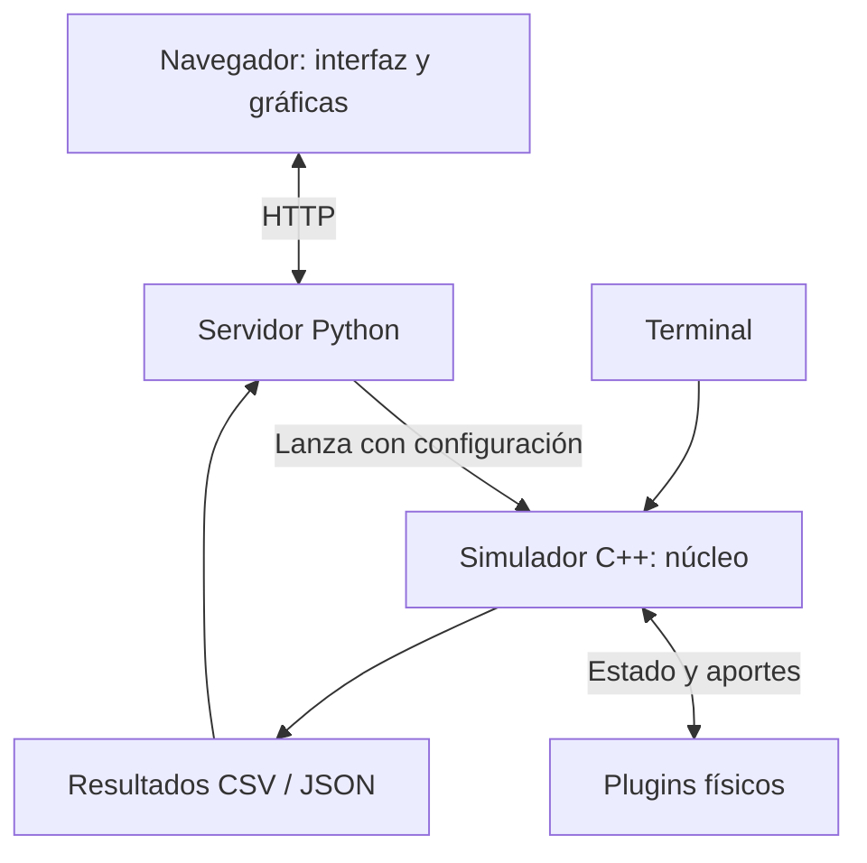

# Apogeo: guía de arquitectura para el nuevo equipo

Esta guía acompaña las 15 diapositivas de la [presentación interactiva](./presentacion-apogeo.html)
y su [versión PDF](./presentacion-apogeo.pdf). El objetivo es entender las piezas,
el recorrido de una simulación y dónde comenzar una tarea. En el HTML: flechas
para navegar, `N` para notas y `F` para pantalla completa.

## 1. Qué es Apogeo

Apogeo es una plataforma de simulación que representa el estado de un vehículo
y su evolución en el tiempo. El núcleo organiza la ejecución y los módulos
aportan modelos físicos. La capa de resultados y visualización permite preparar
una ejecución y comprender sus resultados mediante datos y gráficas. Algunos modelos están en desarrollo;
contar con la infraestructura no significa que toda la física esté terminada.

## 2. Cómo se organiza

La arquitectura es modular, con un núcleo central y plugins cargados como
bibliotecas dinámicas. La interfaz web y el simulador son procesos distintos.
Los plugins se ejecutan dentro del proceso del simulador.

| Parte | Responsabilidad | Dónde se encuentra |
|---|---|---|
| Visualización | Configurar ejecuciones y mostrar resultados | `tools/web_server/static/` |
| Servidor web | Atender solicitudes y gestionar procesos de simulación | `tools/web_server/` |
| Núcleo | Coordinar estado, plugins, tiempo e integración | `src/core/` |
| Plugins | Encapsular modelos físicos y sus datos | `plugins/` |
| Contratos | Definir interfaces y estructura del estado | `src/api/`, `src/schemas/` |
| Entradas y documentación | Configuración, datasets, diseño y guías | `data/`, `docs/` |

Estas son responsabilidades del sistema; no implican que cada fila sea un
servicio independiente. El simulador también funciona desde la terminal.

## 3. Tecnologías y para qué se usan

| Tecnología | Uso en Apogeo |
|---|---|
| C++17 | Núcleo y plugins |
| Eigen | Operaciones con vectores, matrices y orientación |
| Boost.Odeint | Integración numérica del movimiento |
| FlatBuffers | Esquema y acceso al estado compartido |
| JSON | Configuración y condiciones iniciales; también algunas salidas |
| CSV | Curvas tabuladas de los módulos y resultados |
| Python y HTTP | Servidor y lanzamiento del ejecutable |
| HTML, CSS y JavaScript | Interfaz en el navegador |
| Chart.js | Gráficas de los resultados |
| CMake y vcpkg | Compilación y dependencias |
| GoogleTest | Pruebas de C++ |
| Doxygen | Documentación de la API desde el código |

FlatBuffers no es una base de datos: describe cómo representar y acceder al
estado. La interfaz web actual usa JavaScript directamente y el servidor usa
`http.server` de Python. Chart.js se carga desde un CDN en la página actual.

## 4. Recorrido de una simulación

1. El usuario define condiciones iniciales, módulos y cantidad de pasos.
2. Se carga la configuración y se construye el estado inicial.
3. Se cargan los plugins y se preparan sus datos.
4. El núcleo ejecuta repetidamente un paso de simulación, llamado **tick**.
5. Se registran muestras de resultados según el intervalo configurado.
6. El usuario consulta los archivos o los visualiza en la web.

El estado común incluye posición, velocidad, orientación, masa y entorno.
Un **tick** es una vuelta completa del ciclo de simulación. El valor `dt`
indica cuánto avanza el reloj simulado durante esa vuelta. Por ejemplo:

`100 ticks × 0.01 s = 1 segundo simulado`

Ese segundo simulado puede calcularse en menos o más de un segundo real,
según la máquina y el costo de los modelos activos.

## 5. Qué hace el núcleo en un tick

`SimulationEngine` coordina el ciclo. `PluginManager` carga y ejecuta módulos.
`PhysicsIntegrator` calcula la evolución del movimiento. `TimeManager` gestiona
el reloj y `OutputManager` registra muestras.

El recorrido habitual es:

1. Leer el estado actual y la duración del paso.
2. Ejecutar plugins secuenciales que preparan cambios.
3. Ejecutar plugins paralelos para obtener sus aportes.
4. Esperar a que terminen y sumar fuerzas y torques.
5. Actualizar el movimiento mediante el integrador.
6. Avanzar el reloj y registrar resultados cuando corresponde.

Los plugins paralelos comparten el estado y deben tratarlo como lectura; cada
uno dispone de sus propias salidas. Como límite de la implementación actual,
la rama con fuerzas y torques nulos omite integrar el movimiento. Los detalles
físicos y las condiciones especiales deben consultarse antes de implementar
un modelo nuevo.

## 6. Cómo encaja un plugin

Un plugin se compila como biblioteca dinámica: `.dll`, `.so` o `.dylib`, según
la plataforma. El núcleo y los plugins se implementan en C++. Para comunicarse, el plugin
exporta funciones con ABI de C, declaradas con `extern "C"` en
`src/api/plugin_api.h`. Esto evita que los nombres exportados dependan de las
clases internas de C++; no significa que el plugin esté programado en C.

El ciclo general es crear una instancia, configurar sus datos, participar en
los ticks y liberar recursos. Las operaciones concretas dependen del módulo.

Propulsión sirve como ejemplo de organización:

- **Lectura:** el parser valida un CSV de curvas.
- **Dominio:** la clase del motor mantiene datos y ofrece operaciones propias.
- **Adaptador:** conecta el dominio con el ciclo de vida esperado por el núcleo.
- **Pruebas y documentación:** describen y verifican el contrato del módulo.

El esqueleto actual carga y consulta curvas. El cálculo físico de empuje y
consumo másico está pendiente y el tick devuelve aportes neutros. Ver
[README de propulsión](../../plugins/propulsion/README.md).

## 7. Cómo funciona la visualización

La entrada web actual es `tools/apogeo_web_gui_v2.py`. Sirve los recursos de
`tools/web_server/static/` y expone endpoints HTTP.

El navegador envía una solicitud; el servidor prepara archivos de configuración
y `SimulationManager` lanza el ejecutable C++ con `--config` y `--ticks` mediante
un subproceso. La interfaz consulta periódicamente el estado de la ejecución y
solicita resultados para construir tablas y gráficas con Chart.js.

La física se resuelve en C++. El servidor organiza la ejecución y la interfaz
presenta información. El ejecutable también tiene un protocolo IPC JSON para
otras integraciones, pero la ruta web descrita usa el lanzamiento por CLI.

## 8. Cómo trabajar una funcionalidad

El flujo aplicado en propulsión es una referencia para el equipo:

1. **Definir:** escribir el comportamiento y los criterios de aceptación en
   `functional_spec.md`.
2. **Diseñar:** identificar capa, entradas, salidas y contratos en
   `technical_spec.md`.
3. **Planificar:** dividir el trabajo en `task_list.md`.
4. **Implementar:** modificar la capa correspondiente y conectar su compilación.
5. **Validar:** compilar, ejecutar las pruebas pertinentes y comprobar el caso de uso.
6. **Documentar y revisar:** actualizar guías y API; presentar el cambio con evidencia.

Las specs viven en `docs/specs/`. Las guías explican cómo usar el proyecto;
Doxygen documenta la API; las pruebas verifican comportamientos observables.

## 9. Dónde empezar según la tarea

| Tarea | Primer lugar que revisar |
|---|---|
| Cambiar una gráfica | `tools/web_server/static/js/charts.js` |
| Cambiar el lanzamiento desde la web | `tools/web_server/simulation_manager.py` |
| Cambiar la coordinación del tick | `src/core/SimulationEngine.cpp` |
| Cambiar cómo se ejecutan plugins | `src/core/PluginManager.cpp` |
| Desarrollar el modelo de motor | `plugins/propulsion/` |
| Cambiar el estado compartido | `src/schemas/state_vector.fbs` y sus consumidores |

Para incorporarse, leer el [README](../../README.md), seguir
[BUILD_RUN](../BUILD_RUN.md), ejecutar un caso pequeño y seguir un dato desde
la configuración hasta los resultados. Después, elegir un cambio acotado en
una capa y verificarlo de extremo a extremo.

Tres preguntas ayudan a iniciar cualquier tarea: **¿qué capa cambia?, ¿qué
contrato toca?, ¿cómo demuestro que funciona?**
